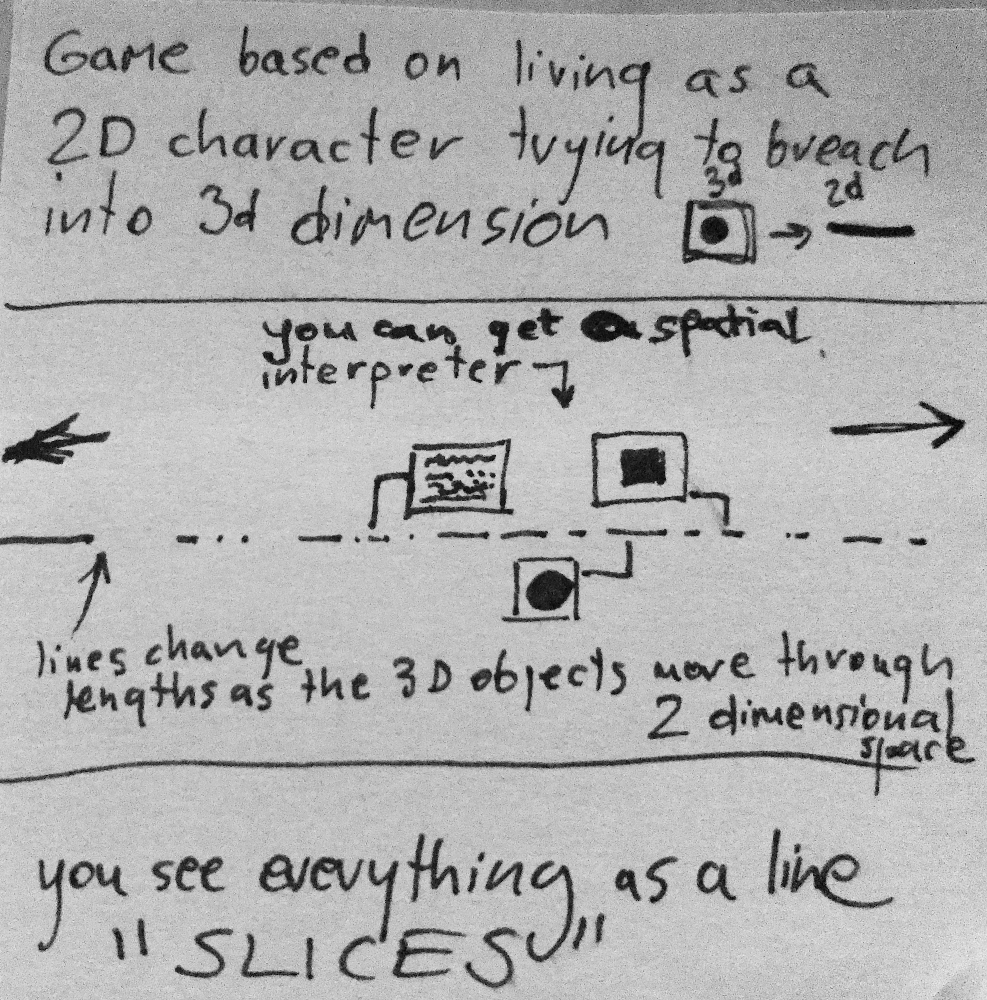

# SLICE

Game based on living as a 2D character trying to breach into the 3rd dimension. You see everything as a line on the horizon. Horizon is the gameplay area really - a single line that gets readjusted as other 3d objects from outside move through the 2d space. Sphere would be an oscillating line.

- you can get a spatial interpreter (step 1 - mechanic unlock)
- lines change lengths as the 3d objects move through 2-dimensional space.
